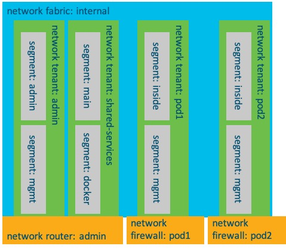

# network-fabric

> Note: This package is a work in progress and not complete.  It is being shared as it is used during some presentations and demos and making the code available is desired.

This is a package for Cisco NSO that aims to provide a simple method for configuring a network using the abstractions of a fabric, tenant, segment, router, and firewall.  The goal is to provide network service data models that allow users to configure the key network attributes for instances of these services, and allow the templates and logic within the service to generate device specific configurations with the defaults and best practices for the organization.  



*A pictorial representation of how the models within the network fabric service interact*

## TL:DR Definitions of the Abstractions 
Here we provide concise definitions of each of the abstractions/models that are included with this package.  More detailed discussions of each model is included within the package definitions and documentation. 

### network fabric 
A network fabric represents a collection of network elements that are connected in such as way where they can be treated as a single "network" object.  While the boundaries between one network and the next can be difficult to articulate, with respect to this abstraction and model the following are key characteristics of a single network fabric. 

* All network elements in a fabric use a shared pool of layer 2 network identifiers, specifically VLAN IDs/names.  Therefore any 2 network elements where `vlan 100` would represent the same logical layer 2 network would be part of the same network fabric 
    * Note: The network fabric service is originally developed to leverage VLANs, however extending to use VXLAN as an alternative/additional layer 2 technology is a desired goal 
* All network elements in a fabric are expected to be connected with "fabric trunks".  These links provide a path to allow all layer 2 networks (network segments) to pass to any point within the fabric 
* Elements in a network fabric will include traditional layer 2 and layer 3 switches, virtual switches from hypervisors (example: VMware dVS), integrated compute networking (example: Cisco UCS Manager)

It could be said that a network fabric is the definition of the "underlay network". 

#### Example Definition
Here is an example definition for a simple network fabric 

```
network-fabric testenv
 description "Primary fabric for the data center"
 spanning-tree root switch-pair spine01
 switch-pair leaf01
  description "Border leaf for fabric"
  switch leaf01-01
  !
  switch leaf01-02
  !
  layer3      true
  multiswitch-peerlink port-channel 1
   member-interface Ethernet [ 1/1 1/2 ]
  !
  fabric-trunk port-channel 11
   description "Link to spine01"
   fabric-peer switch-pair spine01
   member-interface Ethernet [ 1/11 1/12 ]
  !
 !
 switch-pair spine01
  description "Distribution Block"
  switch spine01-01
  !
  switch spine01-02
  !
  layer3      false
  multiswitch-peerlink port-channel 1
   member-interface Ethernet [ 1/1 1/2 ]
  !
  fabric-trunk port-channel 11
   description "Link to leaf01"
   fabric-peer switch-pair leaf01
   member-interface Ethernet [ 1/11 1/12 ]
  !
  fabric-trunk port-channel 12
   description "Link to fi01"
   fabric-peer fabric-interconnect fi01
   member-interface Ethernet [ 1/13 1/14 ]
  !
  fabric-trunk port-channel 13
   description "Link to switch01-01"
   fabric-peer switch switch01-01
   member-interface Ethernet [ 1/15 1/16 ]
  !
  fabric-trunk port-channel 14
   description "Link to switch02-01"
   fabric-peer switch switch02-01
   member-interface Ethernet [ 1/17 ]
  !
 !
 switch switch01-01
  description "TOR switch for some gear"
  fabric-trunk port-channel 11
   description "Link to spine01"
   fabric-peer switch-pair spine01
   member-interface FortyGigabitEthernet [ 1/2/1 1/2/2 ]
  !
 !
 switch switch02-01
  description "Nexus TOR switch"
  fabric-trunk port-channel 11
   description "Link to spine01"
   fabric-peer switch-pair spine01
   member-interface Ethernet [ 1/47 1/48 ]
  !
 !
 fabric-interconnect fi01
  description "FIs for primary compute"
  vnic-template-trunk testenv fabric01-a
   description "vNIC Template for ESXi Hosts A Side"
  !
  vnic-template-trunk testenv fabric01-b
   description "vNIC Template for ESXi Hosts B Side"
  !
 !
 vcenter vcenter01
  description "Main vCenter"
  datacenter testenv
   description "The DC in vCenter"
   vSwitch fabric01
    description "dVS for this fabric"
   !
  !
 !
!
```

### network tenant 
A network tenant represents logical collection of network resources for some unifying purpose.  While exceptions could be configured and used, a common use of a network tenant is as a single "security zone.  A network tenant must be created within a single network fabric, though a single network fabric will likely host multiple network tenants.  

Most network tenants will have a single layer 3 domain (aka VRF), however special cases could exist where a tenant has no layer 3 domains or more than 1.  The default behavior for a tenant is for a single layer3 domain (vrf) to be created.  

When a network tenant is defined and associated with a network fabric, all network elements within the fabric will be configured to support the tenant's resources. 

#### Example Definition
Here is an example definition for a simple network tenant 

```
network-tenant test-admin
 fabric testenv
 layer3 enabled
 layer3 vrf [ default ]
!
network-tenant test-private
 fabric testenv
 layer3 disabled
!
network-tenant test-shared
 fabric testenv
 layer3 vrf [ external internal public ]
!
```

### network segment 
A network segment defines a single layer 2 domain and must be associated to a network tenant (specifically to a single layer 3 domain in a tenant). Most network tenants will have multiple network segments. The simplest way to think of a network segment is as a VLAN, and in fact the rendered configuration of a network segment for devices will likely be as a VLAN.  

Hosts can be connected to a network segement in a variety of ways: 
* Physical interfaces on network elements can be associated to a network segment as an "access port" or as part of a "trunk port" 
* Port-groups on virtual switches are created for network segments allowing virtual machine interfaces to connect to a segment 

Layer 3 aspects of a network segment can be configured to support different options: 
* The underlying fabric supporting the segment can provide layer 3 services by including a SVI for each segement 
* A network firewall or router interface can be attached to a network segment 
* A network segment can be setup as a "layer 2 only" segment with no layer 3 connections

When a network segment is defined and associated with a tenant, all network elements within the relatated fabric will be configured to support this network segment. 

#### Example Definition
Here is an example definition for a simple network segment 

```
network segment pod2-backend
  tenant pod2 
  vlanid           102
  network          10.10.20.0/24
  connections switch-pair leaf02
   interface 1/3
    mode trunk
   !
   interface 1/4
    mode access
```

### network router 
A network router provides a path from one segment in a tenant to another layer 3 network.  This "other" layer 3 network could be: 

* A network segment from another tenant
* A network segment from the same tenant, but a different layer 3 domain
* Some other layer 3 path configured on the underlying network device(s) that provides the "network router" function

A network router defintion includes 1 or more interfaces that are assocated to a network segment.

In addition to basic layer 3 connectivity, a network router can also be configured to support a number of NAT possiblities.  

> An instance of a network router will include either a single network router or a pair if redundancy in the physical network is available. 

#### Example Definition
Here is an example definition for a simple network router 

```
network router pod5-rtr
 device example-rtr-pod5

 interface GigabitEthenet 1
  tenant  pod5
  segment pod5-backend-01
 interface GigabitEthenet 2
  tenant  pod5
  segment pod5-backend-02
 interface GigabitEthenet 3
  tenant  pod5
  segment pod5-backend-03
```

### network firewall 
A network firewall is similar to a network router, but in addition to the router features additional security appliance focused features to what is possible.  These include: 

* Per interface access control lists
* Client VPN features (ie AnyConnect)

> An instance of a network firewall will include either a single network firewall or a pair if redundancy in the physical network is available. 

#### Example Definition
Here is an example definition for a simple network firewall 

```
network firewall pod2
 device example-fw-pod2

 interface inside
  tenant  pod2
  segment pod2-backend
  route 10.10.21.0/24
   gateway 10.10.20.182
  acl-allow DNS_LOOKUPS
   description "Allow DNS Lookups"
   destination ip-list dns-servers
   destination port-list dns-ports

 interface outside
  tenant  dmz02
  segment pod-firewall-outside

 vpn username sbxuser
  password            Bhankd8and
```